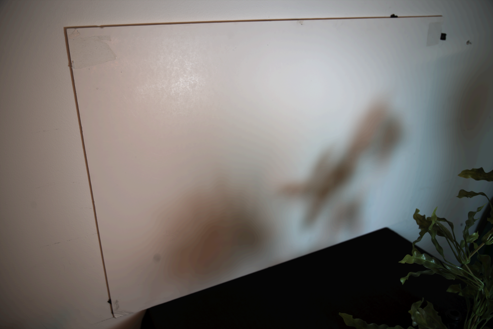
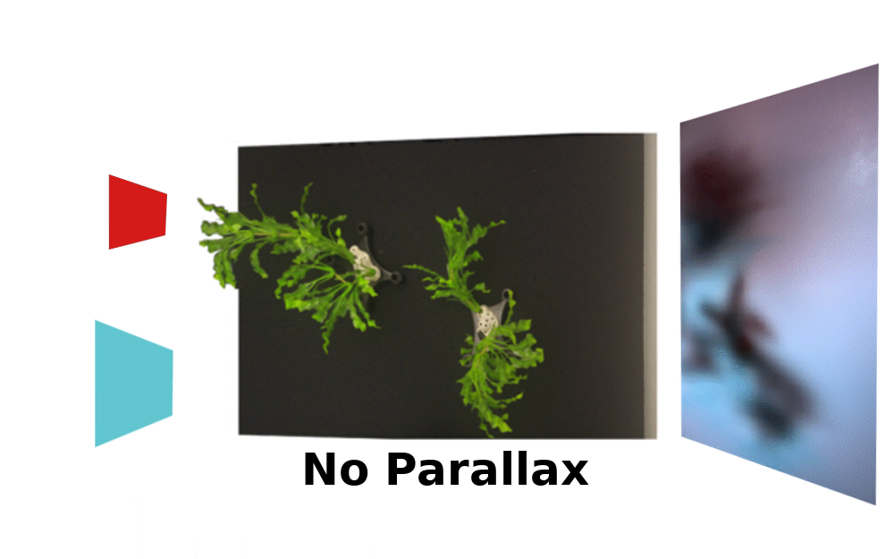
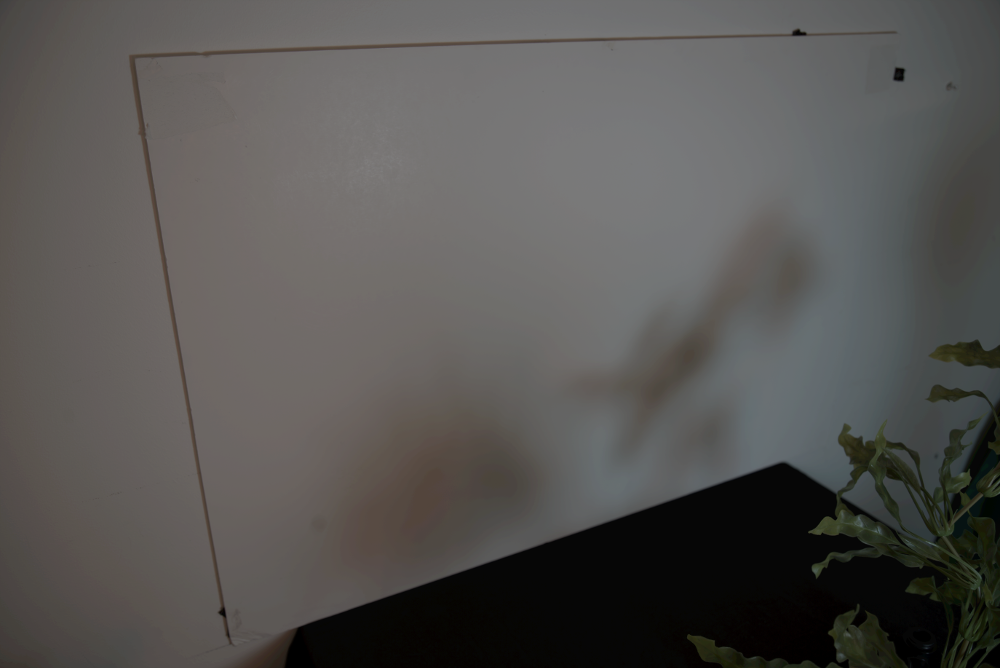
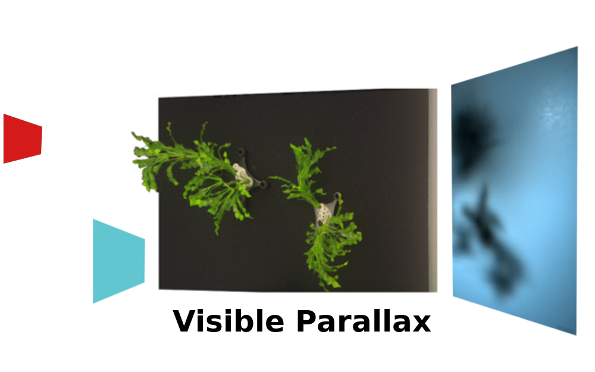
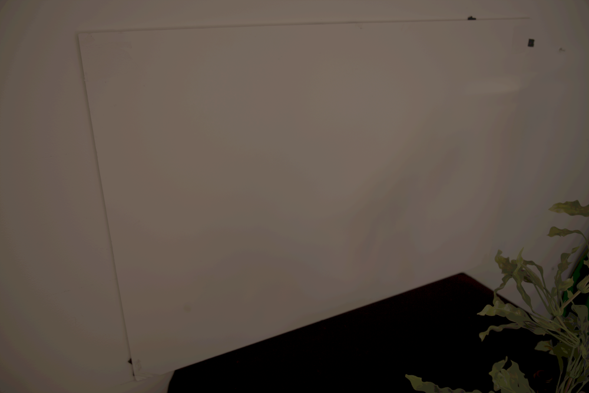
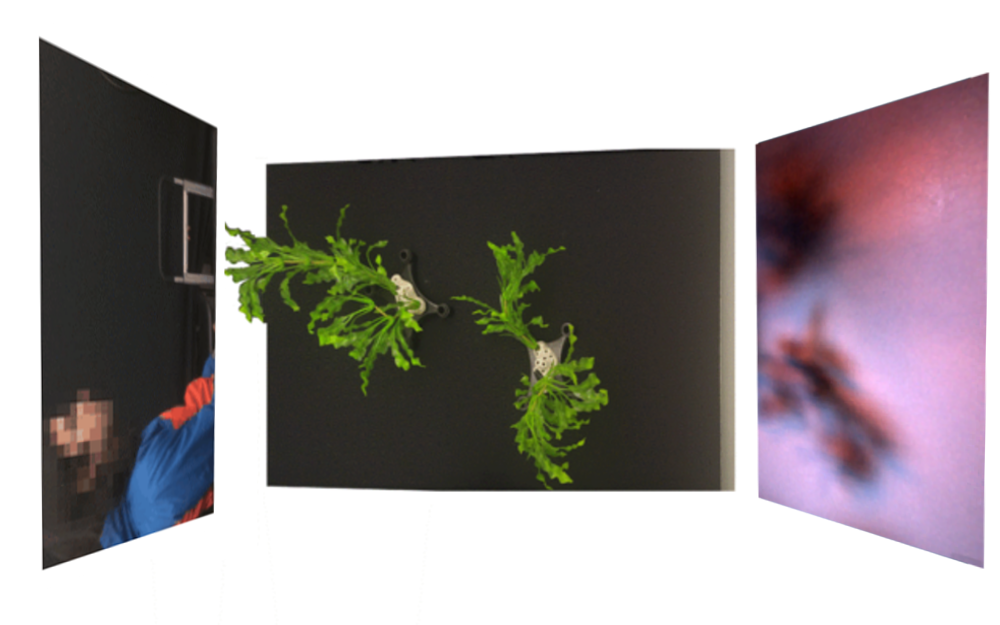
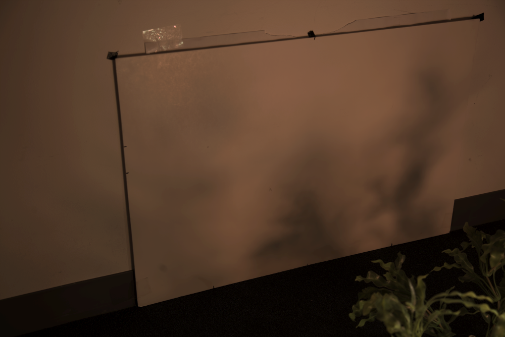
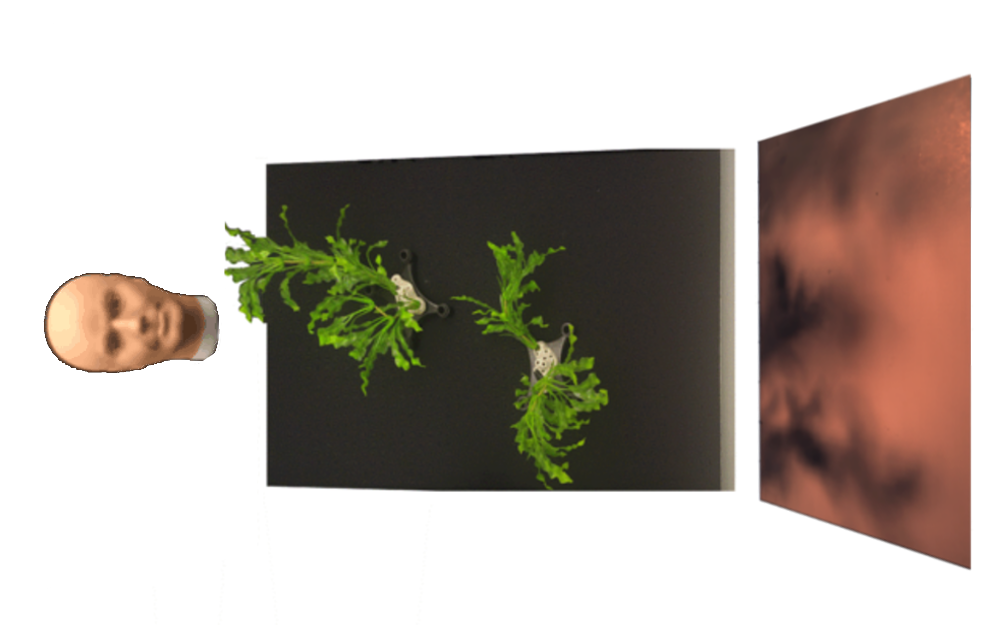
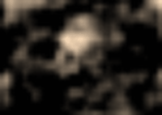

# Inferring Light Fields from Shadows -- CVPR 2018

Code to replicate the experiments in the paper Inferring Light Fields from Shadows:
http://openaccess.thecvf.com/content_cvpr_2018/CameraReady/3977.pdf

<!--- aprox sum of width should be 900 --->
| Observation  | Hidden scene      | Light field reconstruction                                             |
| :---:        |     :---:         |          :---:                                                         |
||| |
|   ||    |
|                ||                 |
|               ||                |


## Usage
1. Using Python 2.7, install dependencies as
   1. GPU (Recommended, appropriate CUDA and cuDNN for tensorflow is required):
        ```bash
        pip install -r requirements-gpu.txt
        ```
   2. No GPU
        ```bash
        pip install -r requirements.txt
        ```
2. Download 
   1. Data:
        ```bash
        ./download_data.sh
        ```
   2. (Optional) cache, to avoid costly operations.
        ```bash
        ./download_cache.sh
        ```
3. Run experiments using:
    ```bash
    ./run_experiments.sh
    ```


## Hardware requirements
##### Memory
32GB of RAM are required to run the experiments as they are. If less RAM is avialable, 
the parameter --K_components allows reducing the solution size, and thus the memory required.
##### GPU
To compute ffts/and iffts, we rely on tensorflow, which allows easy interoperability between GPU and CPU. 
To replicate the experiments without downloading the cache GPU usage is recommended, as it speed ups the process by a 10x factor.

# Citation
```
@InProceedings{Baradad_2018_CVPR,
   author = {Baradad, Manel and Ye, Vickie and Yedidia, Adam B. and Durand, Frédo and Freeman, William T. and Wornell, Gregory W. and Torralba, Antonio},
   title = {Inferring Light Fields From Shadows},
   booktitle = {Proceedings of the IEEE Conference on Computer Vision and Pattern Recognition (CVPR)},
   month = {June},
   year = {2018}
}
```
